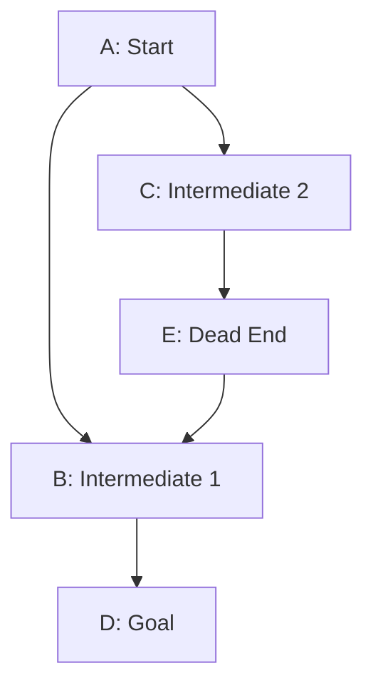

# Classic Graph Search

In classical AI, problem-solving is often framed as a search problem. Whether navigating a map, resolving a puzzle, or planning a sequence of actions, the system represents states as nodes and transitions between states as edges in a graph. Searching this graph to find a path from an initial state to a goal state is a fundamental technique in AI.

While we will look at game-specific search algorithms like alpha-beta pruning in the chess chapter, here we cover the fundamentals of graph representation and pathfinding using Depth-First Search (DFS).

The examples for this chapter are in the directory **source-code/search**.

## Graphs and Search Representation

A **graph** consists of a set of **nodes** (or vertices) connected by **edges**.
- **Directed Graph**: The edges have a direction (e.g., from Node A to Node B).
- **Adjacency List**: A common way to represent a graph in code, mapping each node to a list of its outgoing neighbors.
- **Cycles**: A cycle occurs when a path starting from a node can lead back to the same node (e.g., `B -> C -> D -> B`). Cycles can cause infinite loops in search algorithms if not handled properly.

### Depth-First Search (DFS)

Depth-First Search is an algorithm for traversing or searching tree or graph data structures. The algorithm starts at the root node (selecting some arbitrary node as the root node in the case of a graph) and explores as far as possible along each branch before backtracking.

DFS is naturally recursive, which makes it elegant to implement. However, when searching general graphs (which may contain cycles), we must keep track of **visited** nodes to prevent infinite recursion.

## Implementing Graph Search in TypeScript

Here we define a simple `Graph` implementation in TypeScript. We represent nodes with a unique string identifier and an optional note, and directed edges using an adjacency list.

```typescript
// graph.ts - Graph and DFS implementation in TypeScript

/**
 * Represents a node in the graph structure.
 * Each node is uniquely identified by an ID and can have an optional note.
 */
interface Node {
  /** Unique identifier for the node (e.g., "A", "B"). */
  id: string;
  /** A descriptive label or information associated with the node. */
  note: string;
}

/**
 * Represents an edge between two nodes.
 */
interface Edge {
  from: string;
  to: string;
}

/**
 * A simple Graph data structure.
 */
class Graph {
  /**
   * A collection of all nodes in the graph, mapped by their unique IDs.
   */
  private nodes: Map<string, Node> = new Map();
  private adjacencyList: Map<string, string[]> = new Map();

  /**
   * Adds a new node to the graph and initializes its entry in the adjacency list.
   * 
   * @param id - The unique identifier for the new node.
   * @param note - A description or metadata for the node.
   */
  addNode(id: string, note: string): void {
    this.nodes.set(id, { id, note });
    if (!this.adjacencyList.has(id)) {
      this.adjacencyList.set(id, []);
    }
  }

  /**
   * Adds a directed edge from one node to another.
   */
  addEdge(from: string, to: string): void {
    if (this.nodes.has(from) && this.nodes.has(to)) {
      this.adjacencyList.get(from)?.push(to);
    } else {
      console.error(`Error: One or both nodes (${from}, ${to}) do not exist.`);
    }
  }

  /**
   * Performs a Depth First Search (DFS) to find a path from startNode to goalNode.
   * @returns The path as an array of node IDs, or null if no path exists.
   */
  findPathDFS(startNode: string, goalNode: string): string[] | null {
    const visited = new Set<string>();
    const path: string[] = [];

    const dfs = (currentId: string): boolean => {
      visited.add(currentId);
      path.push(currentId);

      if (currentId === goalNode) {
        return true;
      }

      const neighbors = this.adjacencyList.get(currentId) || [];
      for (const neighbor of neighbors) {
        if (!visited.has(neighbor)) {
          if (dfs(neighbor)) {
            return true;
          }
        }
      }

      path.pop(); // Backtrack
      return false;
    };

    if (!this.nodes.has(startNode) || !this.nodes.has(goalNode)) {
      console.error("Error: Start or goal node does not exist.");
      return null;
    }

    const success = dfs(startNode);
    return success ? path : null;
  }

  /**
   * Prints the current graph structure for debugging.
   */
  printGraph(): void {
    console.log("Nodes:");
    this.nodes.forEach((node) => {
      console.log(` - ${node.id}: ${node.note}`);
    });
    console.log("Edges:");
    this.adjacencyList.forEach((neighbors, from) => {
      console.log(` - ${from} -> ${neighbors.join(", ")}`);
    });
  }
}

// --- Example Usage ---

const myGraph = new Graph();

// Set up example graph data
myGraph.addNode("A", "Start Node");
myGraph.addNode("B", "Intermediate Node 1");
myGraph.addNode("C", "Intermediate Node 2");
myGraph.addNode("D", "Goal Node");
myGraph.addNode("E", "Dead End");

// Set up edges
myGraph.addEdge("A", "B");
myGraph.addEdge("A", "C");
myGraph.addEdge("B", "D");
myGraph.addEdge("C", "E");
myGraph.addEdge("E", "B"); // Cycle example

console.log("Current Graph Structure:");
myGraph.printGraph();

const start = "A";
const goal = "D";
console.log(`\nSearching for path from ${start} to ${goal}...`);

const resultPath = myGraph.findPathDFS(start, goal);

if (resultPath) {
  console.log("Path found:", resultPath.join(" -> "));
} else {
  console.log("No path found.");
}
```

### How the Code Works

1. **Interfaces**:
   - `Node` defines the structure for our vertices, capturing an `id` and a descriptive `note`.
   - `Edge` represents a directed connection between two nodes.

2. **Graph Class**:
   - We use a `Map<string, Node>` to store the node metadata.
   - We use a `Map<string, string[]>` as our **adjacency list** to map each node ID to its list of neighbor node IDs.
   - `addNode` and `addEdge` populate these structures.

3. **Recursive DFS (`findPathDFS`)**:
   - `visited` is a `Set<string>` used to track nodes we have already visited during the search. This is critical to prevent infinite loops when the graph contains cycles.
   - `path` is an array of node IDs that tracks the current path from the start node.
   - The helper function `dfs(currentId)` is called recursively:
     - Mark `currentId` as visited and push it to `path`.
     - If `currentId` is the `goalNode`, return `true` (path found).
     - Otherwise, iterate through all of `currentId`'s neighbors. If a neighbor has not been visited, recursively call `dfs` on it.
     - If all neighbors are explored and the goal is not found, we **backtrack** by popping `currentId` from `path` and returning `false`.


## Example Run

We construct a directed graph containing five nodes (`A`, `B`, `C`, `D`, and `E`) and the following directed edges:
- `A -> B` and `A -> C` (branching point)
- `B -> D` (leads to the goal)
- `C -> E` (leads to a dead end)
- `E -> B` (creates a cycle: `A -> C -> E -> B -> D`)

Here is the graph structure visualized:



### Running the Example

Make sure you install the necessary dependencies (we use `tsx` to run the TypeScript file directly):

```bash
npm install
npx tsx graph.ts
```

Output:
```text
Current Graph Structure:
Nodes:
 - A: Start Node
 - B: Intermediate Node 1
 - C: Intermediate Node 2
 - D: Goal Node
 - E: Dead End
Edges:
 - A -> B, C
 - B -> D
 - C -> E
 - E -> B

Searching for path from A to D...
Path found: A -> B -> D
```

Because DFS explores paths systematically, it immediately finds the path `A -> B -> D`. If we were to search for a path from `C` to `D`, DFS would traverse `C -> E -> B -> D`, successfully avoiding an infinite loop when crossing the cycle `E -> B`.

## Wrap-up

Depth-First Search is a foundational search algorithm. While it is memory-efficient compared to Breadth-First Search (BFS) for deep trees, it does not guarantee finding the *shortest* path (which BFS or Dijkstra's algorithm would). In the next chapter, we will build on search concepts to implement a chess engine using alpha-beta pruning, where the search space is dynamically evaluated to make intelligent game decisions.
