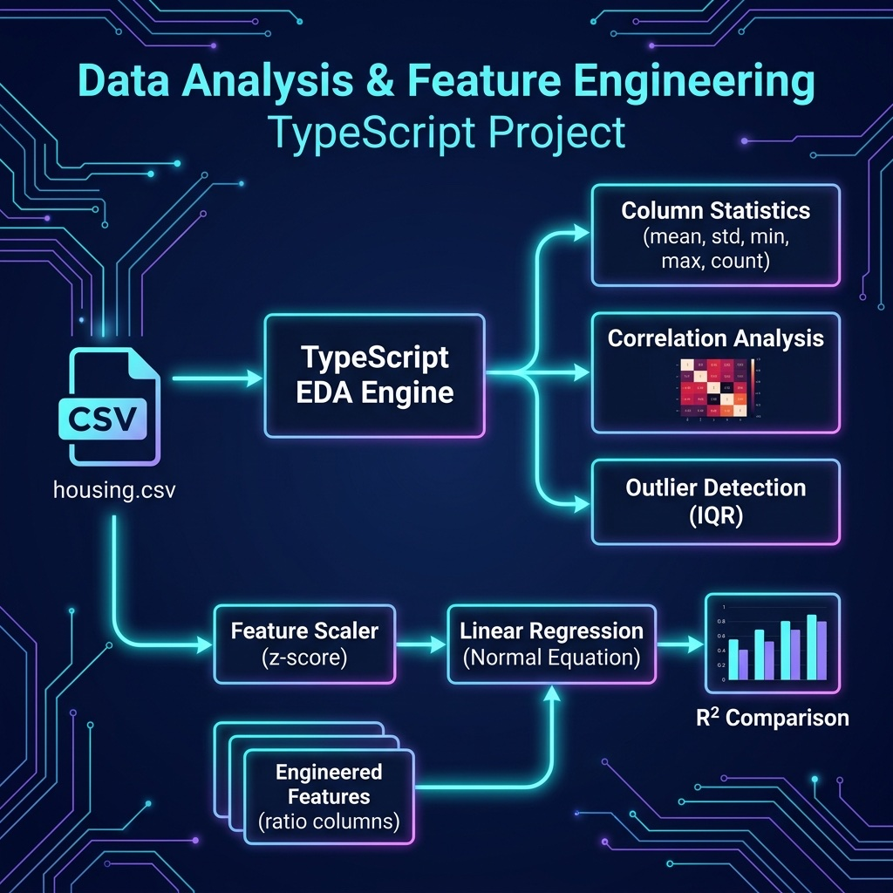

# Data Analysis and Feature Engineering Examples

Exploratory Data Analysis (EDA) and feature engineering techniques.

## Data Files Used

- `../regression_and_clustering/housing.csv`

## Architecture



## Setup

```bash
npm install
```

## Run

```bash
npx tsx eda.ts
npx tsx feature_engineering.ts
```
