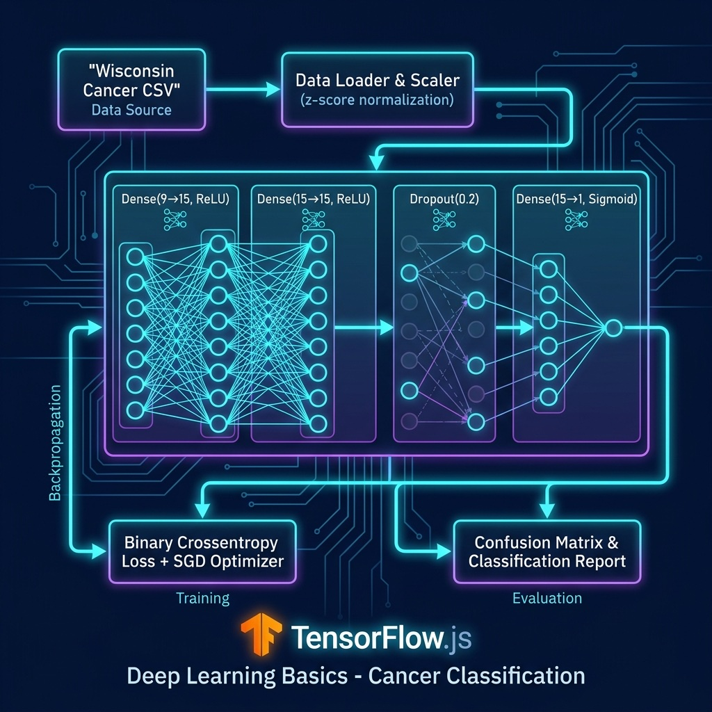

# Deep Learning Basics Examples

Simple neural network model for cancer prediction.

## Data Files Used

- `../machine-learning/labeled_cancer_data.csv`
- `../machine-learning/labeled_test_data.csv`

## Architecture



## Setup

```bash
npm install
```

## Run

```bash
npx tsx cancer_model.ts
```
