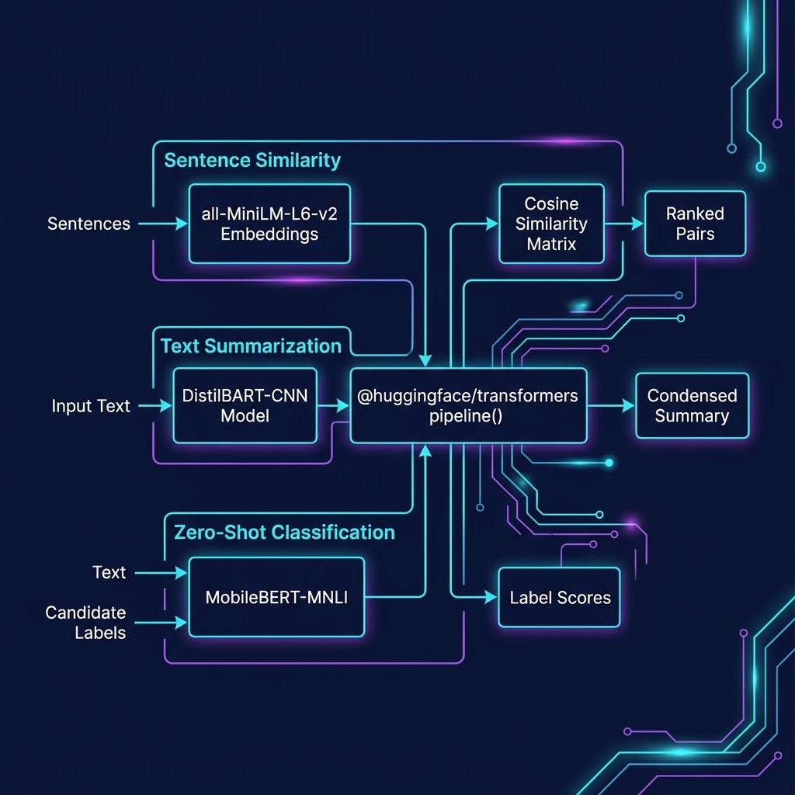

# Deep Learning NLP Examples

Sentence similarity, text summarization, and zero-shot classification using NLP models.

## Architecture



## Setup

```bash
npm install
```

## Run

```bash
npx tsx sentence_similarity.ts
npx tsx summarization.ts
npx tsx zero_shot_classification.ts
```
