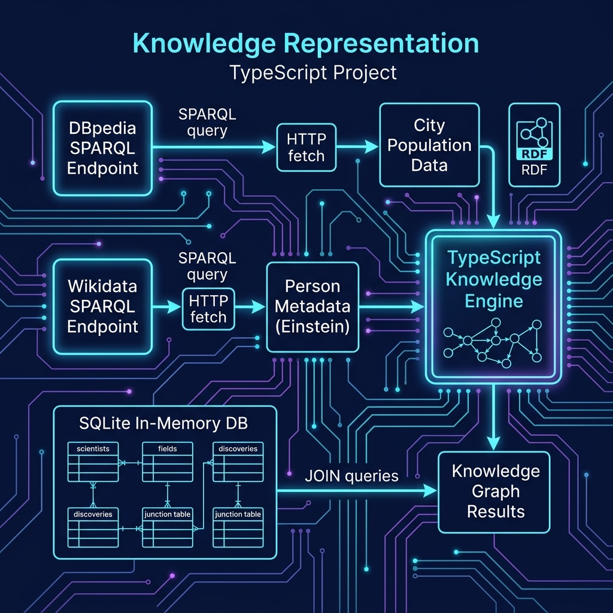

# Knowledge Representation Examples

SPARQL queries (Wikidata, DBPedia) and SQLite knowledge base.

## Architecture



## Setup

```bash
npm install
```

## Run

```bash
npx tsx wikidata_person.ts    # queries Wikidata (no API key needed)
npx tsx dbpedia_cities.ts     # queries DBPedia (no API key needed)
npx tsx sqlite_knowledge.ts   # in-memory SQLite knowledge base
```
