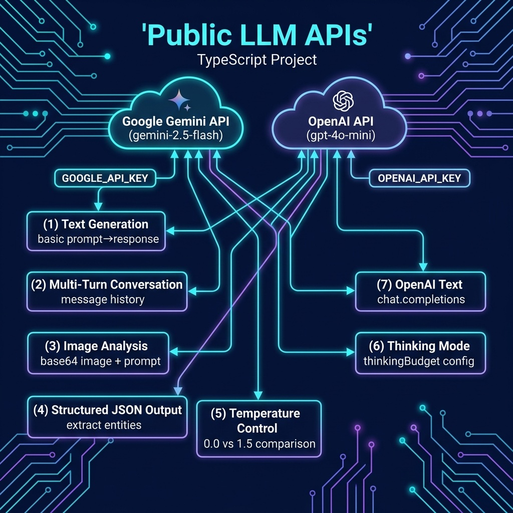

# LLM Public APIs Examples

Examples using Google Gemini and OpenAI APIs.

## Architecture



## Setup

```bash
npm install
export GOOGLE_API_KEY="your-key"
export OPENAI_API_KEY="your-key"
```

## Run

```bash
npx tsx gemini_text.ts
npx tsx openai_text.ts
npx tsx gemini_temperature.ts
npx tsx gemini_thinking.ts
npx tsx gemini_conversation.ts
npx tsx gemini_image.ts photo.jpg
npx tsx gemini_structured.ts
npx tsx gemini_tools.ts
npx tsx openai_tools.ts
```
