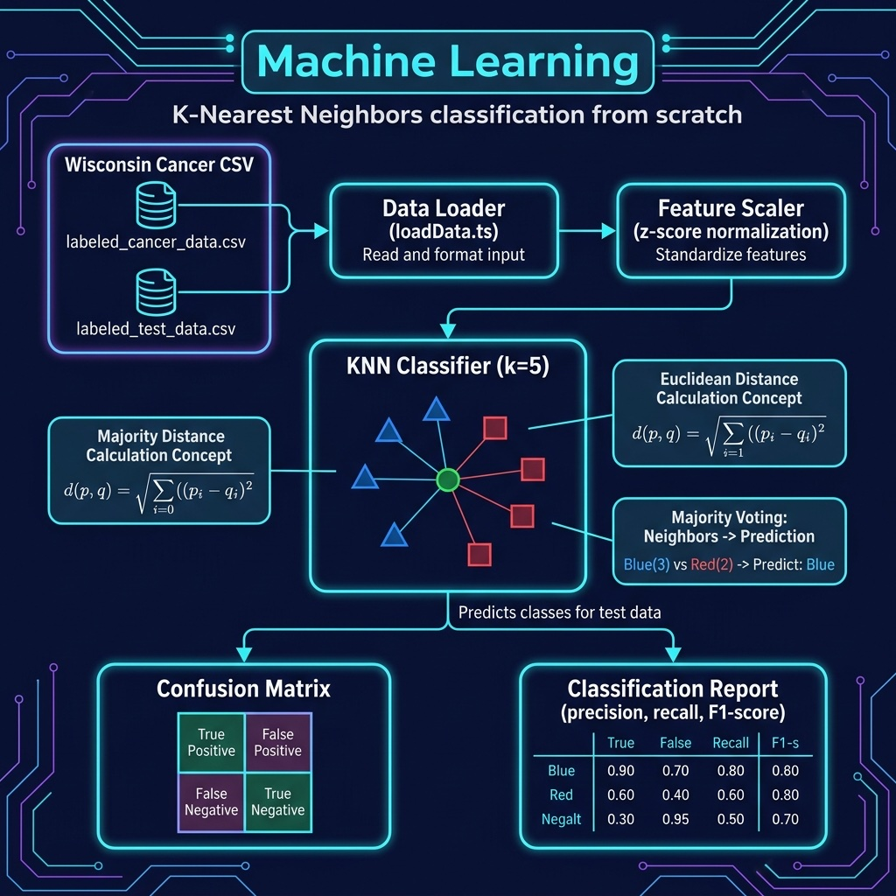

# Machine Learning Examples

K-Nearest Neighbors classifier on the Wisconsin Breast Cancer dataset.

## Architecture



## Setup

```bash
npm install
```

## Run

```bash
npx tsx classification.ts
```
