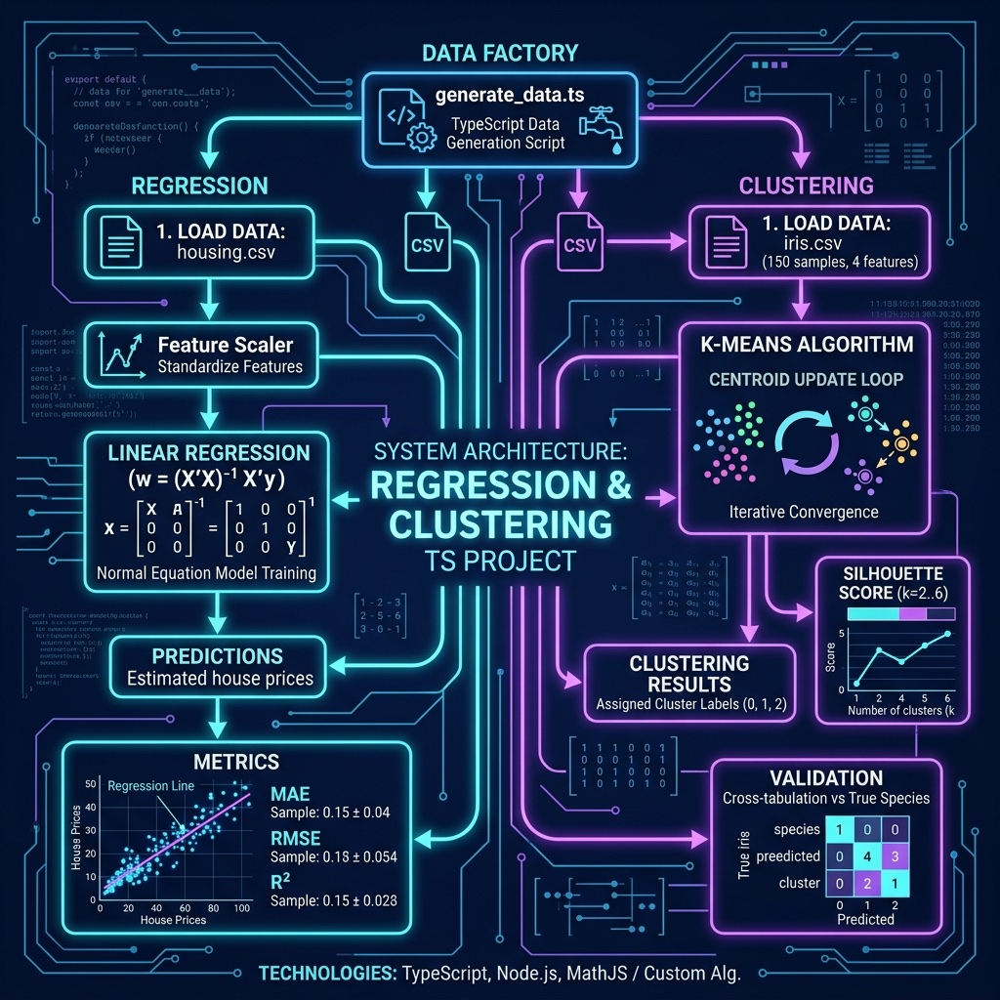

# Regression and Clustering Examples

Linear regression and K-Means clustering from scratch.

## Architecture



## Setup

```bash
npm install
npx tsx generate_data.ts   # generates housing.csv and iris.csv
```

## Run

```bash
npx tsx regression.ts
npx tsx clustering.ts
```
