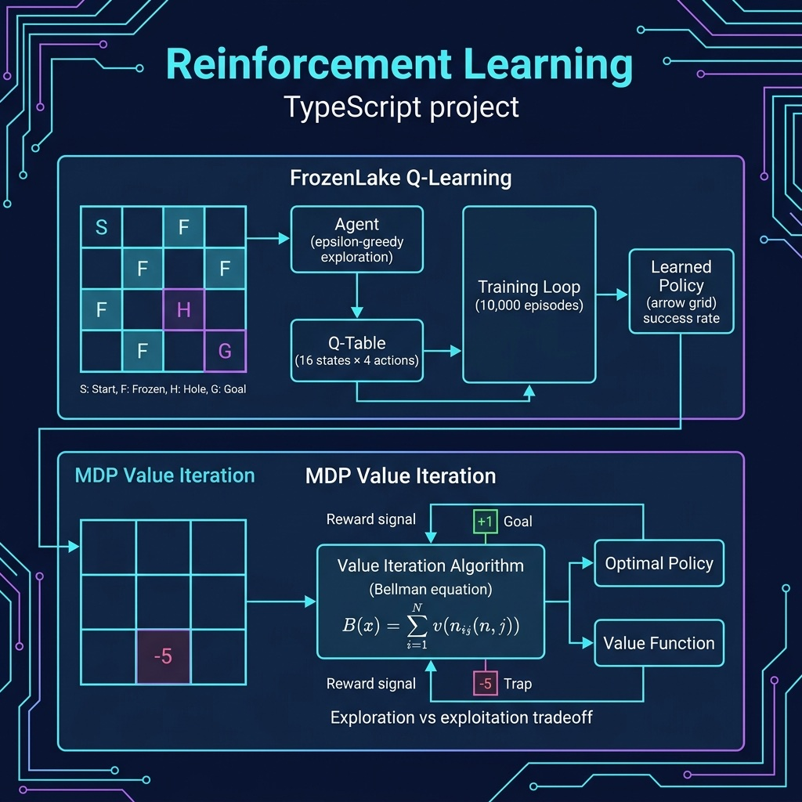

# Reinforcement Learning Examples

Q-Learning on Frozen Lake and Markov Decision Process (MDP) demonstrations.

## Architecture



## Setup

```bash
npm install
```

## Run

```bash
npx tsx frozen_lake_qlearning.ts
npx tsx mdp_demo.ts
```
