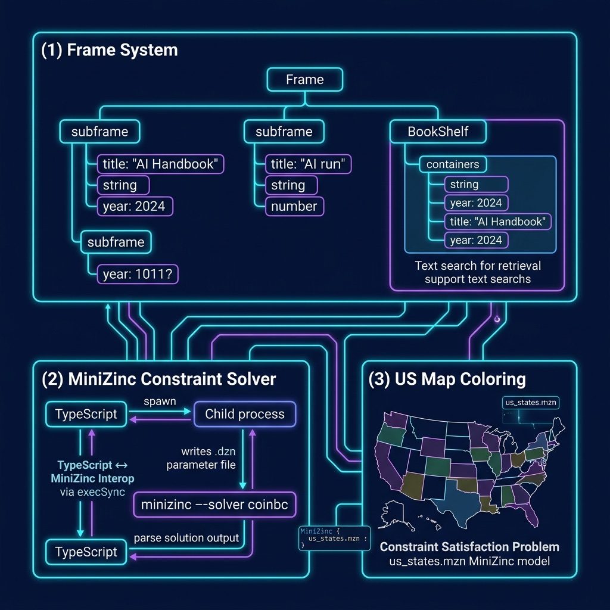

# Symbolic AI Examples

Frame-based knowledge representation and constraint programming with MiniZinc.

## Prerequisites

For MiniZinc examples: `brew install minizinc`

## Architecture



## Setup

```bash
npm install
```

## Run

```bash
npx tsx frame.ts
npx tsx test_mzn.ts       # requires MiniZinc
npx tsx us_states.ts      # requires MiniZinc
```
